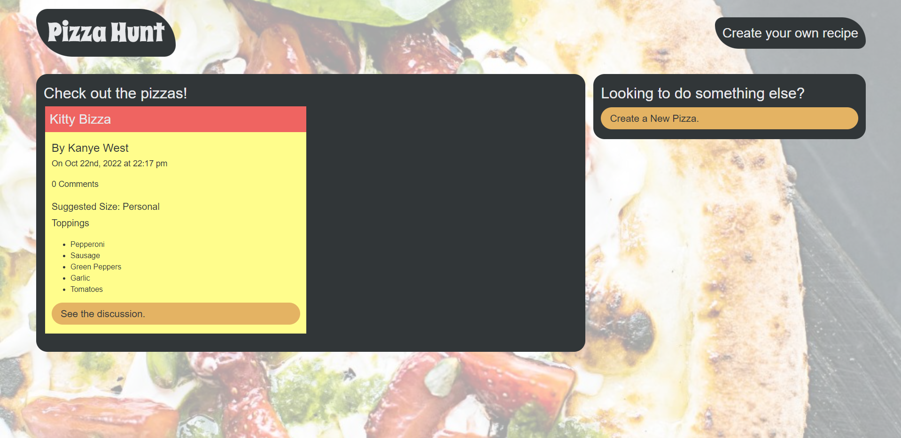
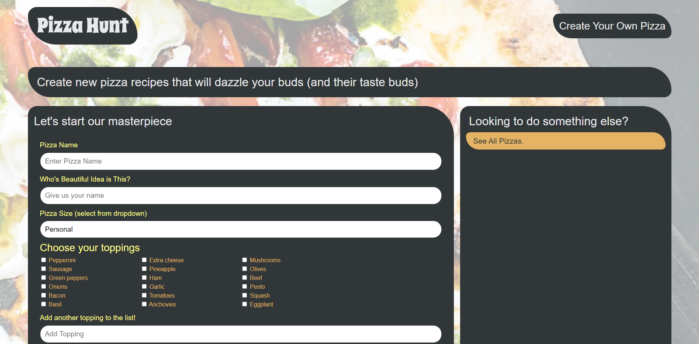

# Pizza Hunt

  
## Description

Pizza Hunt, a social media recipe app where users can post their creative spins on pizza, add comments to recipes, and create threads within comments. Built using MongoDB and Mongoose.





## Table of Contents

- [Installation](#installation)
- [Usage](#usage)
- [License](#license)
- [Contributing](#contributing)
- [Tests](#tests)
- [Questions](#questions)

## Usage

Navigate to the [Website](https://nifty-pizza-hunt.herokuapp.com/) to view all current pizzas or create a new one if none exist. To create a new pizza, the user is prompted for their name, the pizza name, size, and a list of predefined toppings as well as the option for adding additional custom toppings. Once a pizza is created, users can start a discussion about it via comments and replies.

## Installation

This application requires NodeJS to run. Clone this repository to your local machine and run ```npm i``` to install required dependencies, then run ```npm start``` to initialize the server/database. The application may then be accessed in localhost.

## License
    
Licensed under the [MIT License](https://spdx.org/licenses/MIT.html)

## Contributing

No contributions will be accepted at this time.

## Tests

No testing is planned for this project at this time.

## Questions

Have questions? Reach me at the following sources!

* GitHub: [realnifty](https://github.com/realnifty)
* E-mail: rogelioalbertopedraza@gmail.com or lovecore@pm.me